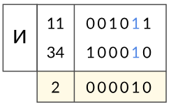
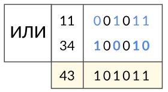
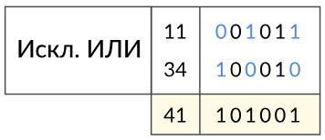
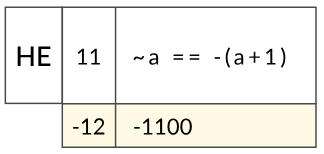
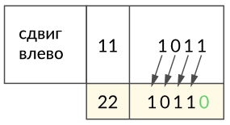
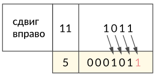

# 4. Операторы в Python


---

## Вступление

Добро пожаловать в тему операторов!

В программировании, независимо от языка, существуют операторы, характерные для большинства популярных языков.
Они позволяют выполнять различные действия и манипуляции с данными. Мы уверены, что полученные знания в этой теме,
также пригодятся вам, если вы решите изучать другие языки программирования.

В этой теме мы рассмотрим операторов Python, их функциональность, особенности и правила использования.

Информации в этой теме будет больше, чем в большинстве других разделов самоучителя. Однако не переживайте, если
сразу не запомните всё. В следующих темах вы будете регулярно возвращаться к этим знаниям и постепенно освоите их.
Пока держите эту тему под рукой как шпаргалку по операторам Python.

> **Обратите внимание**: мы затронем особый _моржовый_ оператор, который сочетает присваивание и сравнение
> в одной конструкции. Подробнее о его возможностях и применении вы узнаете в теме условных конструкций.
> ([Условные операторы](https://github.com/shox-py/topic_6/), [Циклы](https://github.com/shox-py/topic_7/))

---

## Содержание

- [Булевые значения](#булевые-значения)
- [Операторы сравнения](#операторы-сравнения)
- [Операторы присваивания](#операторы-присваивания)
- [Побитовые операторы](#побитовые-операторы)
- [Логические операторы](#логические-операторы)
- [Операторы `in` и `not in`](#операторы-in-и-not-in)
- [Операторы `is` и `is not`](#операторы-is-и-is-not)
- [Значение `None`](#значение-None)
- [Приоритет операторов](#приоритет-операторов)
- [Моржовый оператор](#моржовый-оператор)
- [Задания](#задания)

---

## Булевые значения

В вашу коллекцию знаний о типах данных Python добавляется ещё один тип - `bool`. Он представлен всего двумя значениями:
`True` и `False`. В третьей теме мы частично касались этого типа, а теперь пришло время изучить его подробнее.

Булевые значения - основа логической алгебры, которая позволяет работать с высказываниями, их комбинациями
и определением истинности выражений.

**Пример из жизни**:

Представьте, что вы включаете свет в комнате. Выключатель имеет только два состояния:

- Включен - свет горит.
- Выключен - свет не горит.

В данном случае значение `True` соответствует включенному свету, а `False` - выключенному.
Третьего состояния для выключателя просто не существует.

Булевые значения играют важную роль в условных конструкциях `if`, `while` и операциях сравнения.
Они позволяют задавать условия, на основе которых принимаются решения: _выполняются_ действия или _пропускаются_.

**Пример**:

```python
is_valid = True
is_greater = False

print(is_valid)  # True
print(is_greater)  # False
```

Литералы `True` и `False` записываются без кавычек, поскольку они являются ключевыми словами языка Python.

> Префикс `is_` в названиях переменных часто используется для обозначения булевых значений.
> Это помогает сразу понять, что переменная отвечает на вопрос: `"Является ли?"`.
>
> **Пример**:
>
> - `is_valid` - "Является ли допустимым?"
> - `is_greater` - "Является ли большим?" или "Больше ли?"
> - `is_empty` - "Является ли пустым?"
>
> Использование такого подхода делает код удобным для чтения.
>
> 

### Преобразование других типов в булевый тип

Python позволяет приводить различные типы данных к булевому типу с помощью встроенной функции `bool()`.
При этом некоторые значения будут интерпретироваться как `False`, а другие как `True`.

**Пример**:

```python
print(bool(0))  # False
print(bool(0.0))  # False
print(bool(''))  # False
print(bool(None))  # False
print(bool(False))  # False
```

Почему `False`?:

- `0`, `0.0`, `''` и значение `None` считаются ложными значениями в Python. Они представляют отсутствие
  (пустоту или нулевую величину). Это нужно запомнить, так как такие значения могут повлиять на выполнение условий.

**Пример**:

```python
print(bool(-17))  # True
print(bool(39))  # True
print(bool(1.6894))  # True
print(bool("Не пустая строка"))  # True
print(bool(True))  # True
```

Почему `True`?:

- Все остальные значения, кроме перечисленных в предыдущем примере, считаются истинными значениями.
  Например, числа (включая отрицательные), непустые строки и объекты всегда интерпретируются как `True`.

> **Важно**: Следующие значения функция `bool()` будет интерпретировать как `False`:
>
> - Число `0`
> - Число `0.0`
> - Пустые строки `''` или `""`
> - Значение `None`
> - Значение `False`
>
> Пустые коллекции: (_о коллекциях узнаете в следующей теме_.):
>
>   - `[]` - пустой список
>   - `{}` - пустой словарь
>   - `set()` - пустое множество
>   - `()` - пустой кортеж
>
> Все остальные значения, функцией `bool()` интерпретируются как `True`.

---

## Операторы сравнения

Операторы сравнения позволяют сравнивать значения различных типов данных, результатом такого сравнения
будет булевое значение.

### Таблица 4.1: Операторы сравнения

| Оператор |     Название     | Описание                                                           |
|:--------:|:----------------:|:-------------------------------------------------------------------|
|   `==`   |      равно       | проверяет, являются ли два значения равными.                       |
|   `!=`   |     не равно     | проверяет, являются ли два значения неравными.                     |
|   `>`    |      больше      | проверяет, является ли первое значение большим, чем второе.        |
|   `<`    |      меньше      | проверяет, является ли первое значение меньшим, чем второе.        |
|   `>=`   | больше или равно | проверяет, является ли первое значение большим или равным второму. |
|   `<=`   | меньше или равно | проверяет, является ли первое значение меньшим или равным второму. |

### Сравнение чисел

В программировании сравнение числа с числом происходит как в математике.

**Пример**:

```python
first_num: int = 10
second_num: float = 15.0

less_than: bool = first_num < second_num
less_than_or_equal: bool = first_num <= second_num

print(less_than)  # True
print(less_than_or_equal)  # True

greater_than: bool = first_num > second_num
greater_than_or_equal: bool = first_num >= second_num

print(greater_than)  # False
print(greater_than_or_equal)  # False

equal_to: bool = first_num == second_num
not_equal_to: bool = first_num != second_num

print(equal_to)  # False
print(not_equal_to)  # True
```

В примере выше с помощью разных операторов сравнения мы сравнили числа типа `int` и `float`,
вы можете эти операции выполнить в любой комбинации целое число с целым числом, дробное число с дробным и т.д.
поведение операторов сравнения между числами будет всегда одинаково.

### Сравнение строк

В жизни вы наверняка сталкивались с ситуацией, когда сравнивали два текста или видели, как это делал кто-то другой.
Часто длинное слово воспринимается как **большее**.

В программировании длина строк действительно играет роль, но это лишь один из факторов. Мы не можем сразу утверждать,
что строки равны, только на основании их длины. Даже если длина одинаковая, строки могут отличаться.

**Основные правила сравнения строк**:

1. Если строки разной длины:

    - если первые символы совпадают, то более короткая строка считается `меньше` длинной строки.
    - если первые символы разные, то результат сравнения определяется сравнением этих символов.

2. Если длины строк равны:

    - то сравнение происходит символ за символом, начиная с первого:

        - Как только встречается первый различающийся символ, результат сравнения определяется этим символом.
        - Если не найдено ни одного различающегося символа, тогда строки считаются равными.

> Сравнение строк выполняется на основе их кодовых точек (числовых значений символов) в таблице
> [Unicode](https://home.unicode.org/) или [ASCII](https://snipp.ru/handbk/table-ascii).

1. Если строки разной длины.

**Пример**:

```python
first_line: str = "кот"
second_line: str = "котик"

print(first_line < second_line)  # True
```

Более короткая строка меньше длинной, так как все их первые символы совпадают.

**Пример**:

```python
first_line: str = "ананас"
second_line: str = "арбуз"

print(first_line > second_line)  # False
```

Сравнение начинается с первых символов `'а'` и `'а'`, которые равны. Проверка переходит ко вторым символам
`'н'` и `'р'`. Символ `'н'` меньше символа `'р'` в таблице Unicode, поэтому результат сравнения `False`.

2. Если длины строк равны.

**Пример**:

```python
first_line: str = "собака"
second_line: str = "сова"

print(first_line < second_line)  # True
```

Сравнение происходит символ за символом. Результат определяется первым различающимся символом: `'б'` меньше `'в'`.

**Пример**:

```python
first_line: str = "груша"
second_line: str = "груша"

print(first_line == second_line)  # True
```

Все символы совпадают, значит строки равны.

3. Регистр имеет значение.

**Пример**:

```python
first_line: str = "Яблоко"
second_line: str = "яблоко"

print(first_line < second_line)  # True
```

Заглавная буква `'Я'` меньше строчной `'я'` в таблице Unicode.

4. Оператор `!=`.

Логика работы оператора _не равно_ уже следует из основного правила сравнения строк, возвращает:

- `True`, если строки различны по длине или хотя бы один символ отличается.

**Пример**:

```python
first_line: str = "яблоко"
second_line: str = "груша"

print(first_line != second_line)  # True
```

- `False`, если строки полностью совпадают.

**Пример**:

```python
first_line: str = "арбуз"
second_line: str = "арбуз"

print(first_line != second_line)  # False
```

Запомните, регистр букв играет ключевую роль при сравнении строк. Например, строки `"Мандарины"` и `"мАндаринЫ"`
не равны, так как заглавные и строчные буквы имеют разные кодовые точки.

### Сравнение чисел и строк

В Python сравнивать значения разных типов данных обычно невозможно. Например, сравнение чисел и строк приведет
к ошибке `TypeError`. Это связано с тем, что операторы сравнения `<`, `<=`, `>`, `>=` не поддерживают совместимость
между строками и числами.

**Пример**:

```python
year: int = 2099
month: str = "февраль"

print(year < month)  # TypeError: '<' not supported between instances of 'int' and 'str'
print(year <= month)  # TypeError: '<=' not supported between instances of 'int' and 'str'
print(year > month)  # TypeError: '>' not supported between instances of 'int' and 'str'
print(year >= month)  # TypeError: '>=' not supported between instances of 'int' and 'str'
```

Однако операторы `==` и `!=` работают даже для сравнения чисел и строк. Это происходит потому, что они в первую
очередь проверяют тип данных.

**Пример**:

```python
year: int = 2088
month: str = "август"

print(year == month)  # False
print(year != month)  # True
```

Если типы сравниваемых значений отличаются, результат сравнения будет однозначным:

- `==` - возвращает `False`, так как числа и строки имеют разные типы.
- `!=` - возвращает `True`, поскольку типы значений различны.

> Остальные нюансы строк рассматривается в теме "**Работа со строками**".

---

## Операторы присваивания

Вы уже знакомы с оператором присваивания `=`, который позволяет присваивать значения переменным. 
Мы обсуждали это в предыдущей теме. Теперь пришло время рассмотреть полный список операторов присваивания,

### Таблица 4.2: Операторы присваивания

| Оператор |               Название                | Описание                                                                   |
|:--------:|:-------------------------------------:|:---------------------------------------------------------------------------|
|   `=`    |             присваивание              | присваивает переменной значение, указанное справа.                         |
|   `+=`   |       присваивание со сложением       | увеличивает значение переменной на указанное значение.                     |
|   `-=`   |       присваивание с вычитанием       | уменьшает значение переменной на указанное значение.                       |
|   `*=`   |       присваивание с умножением       | умножает значение переменной на указанное значение.                        |
|   `/=`   |       	присваивание с делением        | делит значение переменной на указанное значение.                           |
|   `%=`   |    присваивание с остатком деления    | присваивает переменной остаток от деления на указанное значение.           |
|  `//=`   | присваивание с целочисленным делением | делит значение переменной на указанное значение, отбрасывая дробную часть. |
|  `**=`   | присваивание с возведением в степень  | возводит значение переменной в указанную степень.                          |

### Присваивание с добавлением

Нет смысла подробно рассматривать каждый оператор присваивания, поскольку их использование схоже. 
Рассмотрим пример с оператором `+=`, чтобы понять, как работают сокращенные формы записи.

**Пример**:

```python
number_of_apples_in_box: int = 10

number_of_apples_in_box = number_of_apples_in_box + 5

print(number_of_apples_in_box)  # 15
```

В этом примере переменная `number_of_apples_in_box` изначально содержит 10. Затем мы добавляем 5 яблок 
и обновляем переменную до 15.

Того же результата можно добиться, переписав этот код более компактно, используя оператор `+=`.

**Пример**:

```python
number_of_apples_in_box: int = 10

number_of_apples_in_box += 5

print(number_of_apples_in_box)  # 15
```

Оба варианта записи работают одинаково, но сокращенная форма делает код более компактным и удобным для чтения.

- Присваивание с вычитанием

**Пример**:

```python
distance_to_destination: int = 150

distance_to_destination -= 30

print(distance_to_destination)  # 120
```

- Присваивание с умножением

**Пример**:

```python
salary: int = 50000

salary *= 2

print(salary)
```

- Присваивание с делением

**Пример**:

```python
total_cost: float = 100.0

total_cost /= 4

print(total_cost)  # 25.0
```

- Присваивание с остатком деления 

**Пример**:

```python
candies: int = 27

candies %= 4

print(candies)  # 3
```

- Присваивание с целочисленным делением

**Пример**:

```python
candies: int = 30

candies //= 8

print(candies)  # 3
```

- Присваивание с возведением в степень

**Пример**:

```python
side: int = 3

side **= 2

print(side)  # 9
```

Сокращенные операторы присваивания делают код более лаконичным и читабельным. Однако в некоторых случаях 
предпочтительнее использовать полную версию, чтобы явно отобразить все этапы вычислений.

Выбор стиля написания остается за вами, но мы рекомендуем использовать компактную запись, 
если это не снижает читабельность кода.

---

## Побитовые операторы

Побитовые операторы работают с данными на уровне их двоичного представления. 
Они применяются для выполнения операций с отдельными битами, в задачах низкоуровневого программирования.


> Если эта тема кажется сложной, вы можете пропустить её и вернуться позже, когда почувствуете 
> себя более уверенно в программировании. Не забывайте, что процесс обучения - это непрерывный и постоянный процесс, и важно гибко подстраиваться под свои 
    потребности и интересы.

Что вы должны знать, чтобы понять этот раздел:

- [Wikipedia: Что такое битовые операции?](https://ru.wikipedia.org/wiki/%D0%91%D0%B8%D1%82%D0%BE%D0%B2%D0%B0%D1%8F_%D0%BE%D0%BF%D0%B5%D1%80%D0%B0%D1%86%D0%B8%D1%8F)
- [Bolshoyvopros: Как перевести числа в двоичную систему?](https://www.bolshoyvopros.ru/questions/1187-kak-perevesti-chisla-v-dvoichnuju-sistemu.html)
- [Video: Что такое таблица истинности?](https://vkvideo.ru/video-188087805_456239021)
- [Wikipedia: Что такое унарный и бинарный операторы?](https://ru.wikipedia.org/wiki/%D0%9E%D0%BF%D0%B5%D1%80%D0%B0%D1%86%D0%B8%D1%8F_(%D0%BF%D1%80%D0%BE%D0%B3%D1%80%D0%B0%D0%BC%D0%BC%D0%B8%D1%80%D0%BE%D0%B2%D0%B0%D0%BD%D0%B8%D0%B5))

### Таблица 4.3: Побитовые операторы

|      Оператор       |               Название               | Описание                                                                              |
|:-------------------:|:------------------------------------:|:--------------------------------------------------------------------------------------|
|         `&`         |        побитовое **И** (AND)         | возвращает результат побитового **И** для каждой пары битов операндов.                |
| <code>&#124;</code> |        побитовое **ИЛИ** (OR)        | возвращает результат побитового **ИЛИ** для каждой пары битов операндов.              |
|         `^`         | побитовое  **Исключающее ИЛИ** (XOR) | возвращает результат побитового **исключающего ИЛИ** для каждой пары битов операндов. |
|         `~`         |   побитовое отрицание (_НЕ_ или NOT)   | возвращает результат побитового отрицания операнда.                                   |
|        `<<`         |          сдвиг битов влево           | сдвигает биты операнда влево на указанное количество позиций.                         |
|        `>>`         |          сдвиг битов вправо          | сдвигает биты операнда вправо на указанное количество позиций.                        |

### Побитовое И

> Бинарный оператор



<small>Источник изображения: [Pythonchik](https://pythonchik.ru/)</small>

**Пример**:

```python
a: int = 11
b: int = 34

c: int = a & b
print(c)  # 2
```

Побитовое **И** (AND) - сравнивает биты и в результате даёт `1` только в том случае, 
если оба сравниваемых бита равны `1`. В остальных случаях результат будет `0`.

### Побитовое ИЛИ

> Бинарный оператор



<small>Источник изображения: [Pythonchik](https://pythonchik.ru/)</small>

**Пример**:

```python
a: int = 11
b: int = 34

c: int = a | b
print(c)  # 43
```

Побитовое **ИЛИ** (OR) - двоичный разряд результата равен `0` только тогда, когда оба соответствующих 
бита равны `0`. Во всех других случаях двоичный результат равен `1`.

### Побитовое Исключающее ИЛИ

> Бинарный оператор



<small>Источник изображения: [Pythonchik](https://pythonchik.ru/)</small>

**Пример**:

```python
a: int = 11
b: int = 34

c: int = a ^ b
print(c)  # 41
```

Побитовое  **Исключающее ИЛИ** (XOR) - ставит `1` на бит результата, для которого только один из соответствующих 
битов операндов равен `1`, но не оба. 

### Побитовое отрицание (НЕ или NOT)

> Унарный оператор



<small>Источник изображения: [Pythonchik](https://pythonchik.ru/)</small>

**Пример**:

```python
a: int = 11

c: int = ~a
print(c)  # -12
```

Побитовое отрицание (НЕ или NOT) - инвертирует все биты операнда. То, что было `1`, становится `0`, и наоборот.

### Сдвиг битов влево

> Бинарный оператор



<small>Источник изображения: [Pythonchik](https://pythonchik.ru/)</small>

**Пример**:

```python
a: int = 11
step: int = 1

c: int = a << step
print(c)  # 22
```

Сдвиг битов влево - сдвигает биты операнда на указанное количество битов влево, начиная с младшего бита. 
Пустые места после сдвига заполняются нулями.

### Сдвиг битов вправо

> Бинарный оператор



<small>Источник изображения: [Pythonchik](https://pythonchik.ru/)</small>

**Пример**:

```python
a: int = 11
step: int = 1

c: int = a >> step
print(c)  # 5
```

Сдвиг битов вправо - сдвигает биты операнда на обозначенное количество битов вправо. 

- Если операнд положительный, то пустые места заполняются нулями. 
- Если же изначально работает с отрицательным числом, то все пустые места слева заполняются единицами.

Побитовые операторы использоваться для повышения эффективности кода, поскольку они часто работают быстрее, 
чем традиционные операторы.

---

## Логические операторы

Логические операторы позволяют сравнивать значения и принимать решения на основе результатов сравнения. 
Они часто применяются в условных конструкциях для управления выполнением кода.

### Таблица 4.4: Логические операторы

| Оператор |        Название         | Описание                                                                                           |
|:--------:|:-----------------------:|:---------------------------------------------------------------------------------------------------|
|  `and`   | логическое **И** (AND)  | возвращает `True`, если оба операнда являются истинными, и `False` в противном случае.             |
|  `or `   | логическое **ИЛИ** (OR) | возвращает `True`, если хотя бы один из операндов является истинным, и `False` в противном случае. |
|  `not `  | логическое **НЕ** (NOT) | возвращает `True`, если операнд является ложным, и `False`, если операнд является истинным.        |

### Логическое И (AND)

**Пример из жизни**:

- Вы планируете пикник и для этого нужно: чтобы **погода была солнечной** и **день был теплым**. 
  Только если оба условия выполнены, вы идете на пикник.

**Пример**:

```python
is_sunny: bool = True
is_warm: bool = True

result: bool = is_sunny and is_warm
print(result)  # True
```

### Логическое ИЛИ (OR)

**Пример из жизни**:

- Вы хотите выпить горячий напиток. Вы рады, если дома есть **кофе** или **чай** - вам не важно, что именно, 
  главное, чтобы хотя бы один из напитков был доступен.

**Пример**:

```python
has_coffee: bool = True
has_tea: bool = False

result: bool = has_coffee or has_tea
print(result)  # True
```

### Логическое НЕ (NOT)

**Пример из жизни**:

- Вы хотите пойти в парк, но только если **не идет дождь**.

**Пример**:

```python
is_raining: bool = True

result: bool = not is_raining
print(result)  # False
```

### Комбинирование логических операторов

Логические операторы можно комбинировать для создания сложных условий.

**Пример из жизни**:

- Вы выбираете куда пойти вечером если: 

  - Ваш друг свободен и у вас есть деньги, вы пойдете в кино.
  - Или, если на улице тепло, вы пойдете на прогулку.

**Пример**:

```python
friend_is_free: bool = True
i_have_money: bool = False
is_warm: bool = True

result: bool = (friend_is_free and i_have_money) or is_warm
print(result)  # True
```

### Приоритет логических операторов

Логические операторы имеют следующий порядок выполнения - приоритет:

- `not`
- `and`
- `or`

Это важно понимать, если вы работаете с выражениями, которые содержат несколько операторов.

**Пример из жизни**:

- Представьте, что вы планируете поездку в другую страну. Для того чтобы поехать, нужно выполнить несколько условий:

  - У вас должен быть паспорт и виза (если эта страна требует визу) для той страны, куда вы собираетесь.
  - Или же, если страна не требует визу, достаточно иметь только паспорт.

**Пример**:

```python
has_passport: bool = True
has_visa: bool = True
is_required_visa: bool = True

result: bool = (has_passport and has_visa and is_required_visa) or (has_passport and not is_required_visa)

print(result)  # True
```

Чтобы избежать неожиданное поведение программы, используйте скобки для явного указания порядка выполнения.

Для полного понимания логических операторов, вам необходимо знать таблицу истинности и базовых 
принципов [булевой алгебры](https://wiki.merionet.ru/articles/osnovy-bulevoj-algebry-true-false-xor-nor-i-logicheskie-simvoly).

### Таблица 4.5: Таблица истинности

|    A    |    B    | A `and` B | A `or` B | `not` A |
|:-------:|:-------:|:---------:|:--------:|:-------:|
| `True`  | `True`  |  `True`   |  `True`  | `False` |
| `True`  | `False` |  `False`  |  `True`  | `False` |
| `False` | `True`  |  `False`  |  `True`  | `True`  |
| `False` | `False` |  `False`  | `False`  | `True`  |

В Python всего три логических оператора, хотя в некоторых языках программирования их больше.

---

## Операторы `in` и `not in`

Операторы `in` и `not in` (также называемые _операторами членства_) позволяют проверить, 
принадлежит ли элемент определенной последовательности. Их часто используют для проверки 
присутствия (или отсутствия) элемента в строке, списке, кортеже, множестве, словаре или др. последовательностях.

### Таблица 4.6: Операторы `in` и `not in`

|   Оператор   |        Название         | Описание                                                                                        |
|:------------:|:-----------------------:|:------------------------------------------------------------------------------------------------|
|    `in`      | оператор членства       | возвращает `True`, если элемент содержится в последовательности, и `False` в противном случае.  |
|  `not in`    | оператор отрицания членства | возвращает `True`, если элемент отсутствует в последовательности, и `False` в противном случае. |

**Пример из жизни**:

- Представьте большой ящик с игрушками. Вы отвечаете на вопросы друзей словами `Да` или `Нет`, 
  проверяя есть ли конкретная игрушка в ящике. 

  - Ящик: `["заяц", "волк", "слон", "лев", "сова", "жираф"]`
  - Вопрос: Есть ли в ящике игрушка `медвежонок`?
    - Ответ: `Нет`.
  - Вопрос: Нет ли в ящике игрушка `медвежонок`?
    - Ответ: `Да`.

Операторы `in` и `not in` работают схожим образом, проверяя наличие или отстуствие элемента,
и возвращая один из двух возможных ответов - `True` или `False`.

### Оператор `in`

Оператор `in` проверяет, **содержится ли** элемент в последовательности.

**Пример**:

```python
sentence: str = "Python is a powerful programming language"

print("Python" in sentence)  # True
print("Java" in sentence)  # False
```

**Пример**:

```python
numbers: list[int] = [10, 20, 30, 40, 50]

print(30 in numbers)  # True
print(60 in numbers)  # False
```

### Оператор `not in`

Оператор not `in` проверяет, **отсутствует ли** элемент в последовательности.

**Пример**:

```python
sentence: str = "Python is a powerful programming language"

print("programming" not in sentence)  # False
print("JavaScript" not in sentence)  # True
```

```python
numbers: list[int] = [10, 20, 30, 40, 50]

print(100 not in numbers)  # True
print(20 not in numbers)  # False
```

Мы начнем часто использовать операторы членства, начиная с темы "условных операторов", 
поэтому пока запомните их функциональные возможности и то, с какими типами они обычно используются.

---

## Операторы `is` и `is not`

Операторы `is` и `is not` (также называемые _операторами тождественности_) используются для 
проверки того, являются ли два объекта одним и тем же объектом в памяти. 
Эти операторы сравнивают **идентичность объектов**, а не ~~их значения~~.

> **Идентичность объекта** определяется его уникальным идентификатором, который можно получить 
> с помощью функции `id()`. Если два объекта имеют одинаковый идентификатор, то это один и тот же объект.

### Таблица 4.7: Операторы `is` и `is not`

|   Оператор   |        Название          | Описание                                                                                                      |
|:------------:|:------------------------:|:--------------------------------------------------------------------------------------------------------------|
|    `is`      | оператор тождественности | возвращает `True`, если оба операнда являются одним и тем же объектом в памяти, и `False` в противном случае. |
|  `is not`    | оператор отрицания тождественности | возвращает `True`, если операнды являются разными объектами в памяти, и `False` в противном случае.                                         |

**Пример из жизни**:

- Представьте, что у вас есть две одинаковые книги, но они лежат в разных местах: _на столе_ и _на полке_.
  Хотя содержание книг идентично (их значения равны), это не одна и та же книга (их идентичность различается).
  
  - Оператор `is` отвечает на вопрос: `Это одна и та же книга?`.
  - А оператор `==` отвечает на: `Одинаково ли содержание этих книг?`.

> Чтобы понять следующие примеры, вам необходимо вспомнить
> [атомарные и ссылочные типы данных](https://github.com/shox-py/topic_3/?tab=readme-ov-file#%D0%B0%D1%82%D0%BE%D0%BC%D0%B0%D1%80%D0%BD%D1%8B%D0%B5-%D0%B8-%D1%81%D1%81%D1%8B%D0%BB%D0%BE%D1%87%D0%BD%D1%8B%D0%B5-%D1%82%D0%B8%D0%BF%D1%8B-%D0%B4%D0%B0%D0%BD%D0%BD%D1%8B%D1%85),
> которые мы обсуждали в предыдущей теме.

### Оператор `is`

Оператор `is` проверяет, **являются ли два объекта одним и тем же** объектом.

**Пример**:

```python
first_line: str = "Привет, Мир!"
second_line: str = "Привет, Мир!"

result: bool = first_line is second_line
print(result)  # True
```

В этом примере у нас есть две разные переменные, но мы все равно получаем `True`, причина в атомарности типа `str`.
То же самое произойдет с числовыми, логическими типами и типом `None`.

**Пример**:

```python
x: int = 10
y: int = 10

flag_one: bool = True
flag_two: bool = True

first_name: None = None
last_name: None = None

print(x is y)  # True
print(flag_one is flag_two)  # True
print(first_name is last_name)  # True
```

Со ссылочными типами дело обстоит иначе, поскольку они всегда создаются как новый объект в памяти компьютера. 
Мы еще не обсуждали тему других типов данных, но рассмотрим их в следующей теме. А пока давайте рассмотрим 
несколько примеров со списками, чтобы понять, как работают операторы `is` и `is not`.

**Пример**:

```python
weekdays: list[int] = [1, 2, 3, 4, 5, 6, 7]
nums: list[int] = [1, 2, 3, 4, 5, 6, 7]

result_one: bool = weekdays is nums
result_two: bool = weekdays == nums

print(result_one)  # False
print(result_two)  # True
```

В этом примере есть два списка, и их содержимое одинаково, но это не один и тот же список. 
Вот почему операторы `is` и `==` возвращают разные значения.

- Оператор `==` проверяет, одинаково ли содержимое списка.
- Оператор `is` проверяет, являются ли эти списки одним и тем же объектом в памяти.

> Если вам нужно сравнивать значения объектов, всегда используйте оператор равенства `==`, а не `is`.

**Пример**:

```python
weekdays: list[int] = [1, 2, 3, 4, 5, 6, 7]
nums: list[int] = weekdays

result_one: bool = weekdays is nums
result_two: bool = weekdays == nums

print(result_one)  # True
print(result_two)  # True
```

В данном примере уже оба оператора возвращают `True`, потому что у нас всего один список и 
этот список мы также присвоили к переменной `nums`.


### Оператор `is not`

Оператор `is not` делает обратное оператору `is`, т.е. другими словами являются ли два объекта **разными**. 

**Пример**:

```python
first_line: str = "Привет, Мир!"
second_line: str = "Привет, Мир!"

x: int = 10
y: int = 10

flag_one: bool = True
flag_two: bool = True

first_name: None = None
last_name: None = None

print(first_line is not second_line)  # False
print(x is not y)  # False
print(flag_one is not flag_two)  # False
print(first_name is not last_name)  # False
```

**Пример**:

```python
weekdays: list[int] = [1, 2, 3, 4, 5, 6, 7]
nums: list[int] = [1, 2, 3, 4, 5, 6, 7]

print(weekdays is not nums)  # True
print(weekdays != nums)  # False
```

**Пример**:

```python
weekdays: list[int] = [1, 2, 3, 4, 5, 6, 7]
nums: list[int] = weekdays

print(weekdays is not nums)  # False
print(weekdays != nums)  # False
```

Операторы тождественности часто используются в объектно-ориентированном программировании.
И их правильное использование показывает опыт разработчика; не стоит пренебрегать 
использованием этих операторов. Иногда важно проверять только значение объектов, а не их 
идентичность. Под этим мы подразумеваем, что выбор между этими операторами зависит от 
контекста и требований конкретной задачи.

---

## Значение `None`

В Python существует специальное значение, называемое `None`, которое указывает на отсутствие значения 
или неопределенное состояние. Оно часто используется, когда переменной нужно присвоить значение, но 
на момент объявления неизвестно, каким оно будет.

> `None` - это объект специального типа данных `NoneType`, и он не обладает встроенной функцией преобразования, как 
> это реализовано для других типов данных, например для целых чисел через `int()` или строк через `str()`.

**Пример**:

```python
full_name: None | str = None

first_name: str = input("Ваше имя: ")
last_name: str = input("Ваша фамилия: ")

if first_name and last_name:
    full_name = first_name + " " + last_name

if full_name is not None:
    print("Имя и фамилия:", full_name)
else:
    print("Пользователь не указал все данные")
```

- В этом примере переменная `full_name` изначально указывает на `None`, так как полное имя еще не известно. После того, 
как пользователь  вводит значения для `first_name` и `last_name`, условие `if first_name and last_name` проверяет, 
введены ли оба значения. Если оба поля заполнены, переменной full_name присваивается объединение имени и фамилии.

- После этого выполняется проверка `if full_name is not None`, если условие _истина_, выводится сообщение 
с полным именем пользователя, в противном случае информация о том что пользователь не указал все необходимые данные.

Неправильное сравнение с `None` может привести к ошибкам или непредсказуемому поведению.

**Пример**:

```python
instance: None | str = None  

if instance == None:
    ...
```

Никогда не проверяйте на `None`, как в примере выше, всегда используйте `is` или `is not` для проверки.

**Пример**:

```python
instance: None | str = None  

if instance is None:
    ...
```

> Оператор `==` проверяет равенство значений, а не идентичность объектов.

Подводя итог, можно сказать, что значение `None` может служить индикатором того, что значение переменной 
еще не задано, и может быть заменено определенным значением позднее в программе.

---

### Приоритет операторов

Операторы имеют различные уровни приоритета, что определяет порядок их выполнения в выражении. Понимание приоритета
операторов поможет вам правильно интерпретировать результаты выражений и избегать путаницы.

Рассмотрим несколько простых примеров:

**Арифметические операторы:**

```python
result = 2 + 3 * 4
print(result)  # Результат: 14
```

* В данном случае оператор умножения `*` имеет более высокий приоритет, чем оператор сложения `+`, поэтому он
  выполняется первым. Результат будет равен `2 + (3 * 4) = 2 + 12 = 14`.

**Операторы сравнения:**

```python
result = 5 < 3 == True
print(result)  # Результат: False
```

* Оператор сравнения `<` (меньше) имеет более высокий приоритет, чем оператор сравнения `==` (равно).
  Поэтому выражение сначала сравнивает `5 < 3`, что дает `False`, а затем сравнивает `False == True`, что дает `False`.

**Логические операторы:**

* Операторы `not`, `and` и `or` имеют следующий порядок приоритета (от наивысшего к наименьшему):

    - not
    - and
    - or

```python
result = not True or False and True
print(result)  # Результат: False
```

Сначала выполнится операция `not True`, которая даст результат `False`. Затем будет выполнена операция
`False or False and True`, где сначала выполнится `False and True`, результат `False`, а затем `False or False`,
конечный результат `False`.

Важно помнить, что при необходимости изменить порядок выполнения операций, всегда можно использовать скобки, чтобы явно
указать приоритет:

```python
result = (2 + 3) * 4
print(result)  # Результат: 20
```

В данном случае операторы в скобках выполняются первыми, а затем результат умножается на `4`. Результат будет
равен `(2 + 3) * 4 = 5 * 4 = 20`.

Это лишь некоторые примеры для демонстрации приоритета операторов. При работе с более сложными выражениями
всегда полезно обращаться к таблице приоритетов операторов для точного определения порядка их выполнения.

Таблица приоритетов операторов, операторы расположены по убыванию приоритета:

|                 Оператор                 | Описание                                           |
|:----------------------------------------:|:---------------------------------------------------|
|                   `()`                   | Группировка                                        |
|      ` x[index]`, `x[index:index]`       | Обращение к элементу или срезу в списке или строке |
|          `f(args...)`, `x.attr`          | Вызов функции или метода                           |
|                   `**`                   | Возведение в степень                               |
|             `+x`, `-x`, `~x`             | Унарные плюс, минус, инверсия                      |
|           `*`, `/`, `//`, `%`            | Умножение, деление, целочисленное деление, остаток |
|                 `+`, `-`                 | Сложение, вычитание                                |
|                `<<`, `>>`                | Побитовый сдвиг влево, вправо                      |
|                   `&`                    | Побитовое **И**                                    |
|                   `^`                    | Побитовое исключающее **ИЛИ**                      |
|           <code>&#124;</code>            | Побитовое **ИЛИ**                                  |
|     `<`, `<=`, `>`, `>=`, `==`, `!=`     | Сравнение                                          |
|                  `not`                   | Логическое **НЕ**                                  |
|                  `and`                   | Логическое **И**                                   |
|                   `or`                   | Логическое **ИЛИ**                                 |
|               `if` `else`                | Условный оператор `if` `else`                      |
|                 `lambda`                 | Лямбда-выражение                                   |
| `=`, `+=`, `-=`, `*=`, `/=`, `//=`, `%=` | Присваивание и составные операторы присваивания    |
|                   `:=`                   | Моржовый оператор                                  | 

---

### Моржовый оператор

_Этот раздел рекомендуется изучать после того, как ознакомитесь с темой `Условные операторы`. Условные операторы
представляют собой важную основу для понимания работы моржового оператора и его применения._

_Если вы уже знакомы с условными операторами и уверены в своих навыках работы с ними, можете приступить к изучению
раздела._

Моржовый оператор, также известный как оператор присваивания значения в выражении `:=`, является нововведением в Python
3.8. Он предоставляет удобный способ одновременного присвоения значения переменной и его проверки в условии. часто
используется для улучшения читаемости кода и уменьшения повторений. Вот несколько примеров, демонстрирующих применение
моржового оператора:

**Пример 1: Проверка и присвоение значения**

```python
# Пример с использованием моржового оператора
if (n := len(my_list)) > 0:
    print("Длина списка:", n)
else:
    print("Список пуст")

# Эквивалентный код без использования моржового оператора
n = len(my_list)
if n > 0:
    print("Длина списка:", n)
else:
    print("Список пуст")
```

**Пример 2: Присвоение значения**

```python
# Пример с использованием моржового оператора
if (value := 10) > 0:
    result = "Положительное число"
else:
    result = "Отрицательное число или ноль"
print(result)

# Эквивалентный код без использования моржового оператора
value = 10
if value > 0:
    result = "Положительное число"
else:
    result = "Отрицательное число или ноль"
print(result)
```

**Пример 3: Проверка и присвоение значения**

```python
# Пример с использованием моржового оператора
a = 5
b = 10
if (c := a + b) > 0:
    print("Сумма a и b:", c)
else:
    print("Сумма a и b меньше или равна нулю")

# Эквивалентный код без использования моржового оператора
a = 5
b = 10
c = a + b
if c > 0:
    print("Сумма a и b:", c)
else:
    print("Сумма a и b меньше или равна нулю")
```

Моржовый оператор позволяет компактно объединить присваивание и проверку в одной строке кода, делая код более читаемым и
эффективным.

**Важно:** Однако его следует использовать с умеренностью, чтобы не ухудшить читаемость кода.

---

Поздравляем! Вы изучили основные операторы, которые являются важным инструментом для работы с данными и
управления логикой программы.

В следующей теме `Основы коллекций в Python` мы углубимся в работу с различными типами коллекций данных, такими как
списки, кортежи, множества и словари.

---

### [Задания](./tasks/TASKS.md)


## Полезные ссылки:

- [Merion: Основы булевой алгебры: True, False, XOR, NOR и логические символы](https://wiki.merionet.ru/articles/osnovy-bulevoj-algebry-true-false-xor-nor-i-logicheskie-simvoly)
