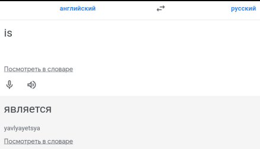

# 4. Операторы в Python


---

## Вступление

Добро пожаловать в тему операторов!

В программировании, независимо от языка, существуют операторы, характерные для большинства популярных языков.
Они позволяют выполнять различные действия и манипуляции с данными. Мы уверены, что полученные знания в этой теме,
также пригодятся вам, если вы решите изучать другие языки программирования.

В этой теме мы рассмотрим операторов Python, их функциональность, особенности и правила использования.

Информации в этой теме будет больше, чем в большинстве других разделов самоучителя. Однако не переживайте, если
сразу не запомните всё. В следующих темах вы будете регулярно возвращаться к этим знаниям и постепенно освоите их.
Пока держите эту тему под рукой как шпаргалку по операторам Python.

> **Обратите внимание**: мы затронем особый _моржовый_ оператор, который сочетает присваивание и сравнение
> в одной конструкции. Подробнее о его возможностях и применении вы узнаете в теме условных конструкций.
> ([Условные операторы](https://github.com/shox-py/topic_6/), [Циклы](https://github.com/shox-py/topic_7/))

---

## Содержание

- [Булевые значения](#булевые-значения)
- [Операторы сравнения](#операторы-сравнения)
- [Операторы присваивания](#операторы-присваивания)
- [Побитовые операторы](#побитовые-операторы)
- [Логические операторы](#логические-операторы)
- [Операторы `in` и `not in`](#операторы-in-и-not-in)
- [Операторы `is` и `is not`](#операторы-is-и-is-not)
- [`None` - специальное значение отсутствия значения](#None---специальное-значение-отсутствия-значения)
- [Приоритет операторов](#приоритет-операторов)
- [Моржовый оператор](#моржовый-оператор)
- [Задания](#задания)

---

## Булевые значения

В вашу коллекцию знаний о типах данных Python добавляется ещё один тип - `bool`. Он представлен всего двумя значениями:
`True` и `False`. В третьей теме мы частично касались этого типа, а теперь пришло время изучить его подробнее.

Булевые значения - основа логической алгебры, которая позволяет работать с высказываниями, их комбинациями
и определением истинности выражений.

**Пример из жизни**:

Представьте, что вы включаете свет в комнате. Выключатель имеет только два состояния:

- Включен - свет горит.
- Выключен - свет не горит.

В данном случае значение `True` соответствует включенному свету, а `False` - выключенному.
Третьего состояния для выключателя просто не существует.

Булевые значения играют важную роль в условных конструкциях `if`, `while` и операциях сравнения.
Они позволяют задавать условия, на основе которых принимаются решения: _выполняются_ действия или _пропускаются_.

**Пример**:

```python
is_valid = True
is_greater = False

print(is_valid)  # True
print(is_greater)  # False
```

Литералы `True` и `False` записываются без кавычек, поскольку они являются ключевыми словами языка Python.

> Префикс `is_` в названиях переменных часто используется для обозначения булевых значений.
> Это помогает сразу понять, что переменная отвечает на вопрос: `"Является ли?"`.
>
> **Пример**:
>
> - `is_valid` - "Является ли допустимым?"
> - `is_greater` - "Является ли большим?" или "Больше ли?"
> - `is_empty` - "Является ли пустым?"
>
> Использование такого подхода делает код удобным для чтения.
>
> 

### Преобразование других типов в булевый тип

Python позволяет приводить различные типы данных к булевому типу с помощью встроенной функции `bool()`.
При этом некоторые значения будут интерпретироваться как `False`, а другие как `True`.

**Пример**:

```python
print(bool(0))  # False
print(bool(0.0))  # False
print(bool(''))  # False
print(bool(None))  # False
print(bool(False))  # False
```

Почему `False`?:

- `0`, `0.0`, `''` и значение `None` считаются ложными значениями в Python. Они представляют отсутствие
  (пустоту или нулевую величину). Это нужно запомнить, так как такие значения могут повлиять на выполнение условий.

**Пример**:

```python
print(bool(-17))  # True
print(bool(39))  # True
print(bool(1.6894))  # True
print(bool("Не пустая строка"))  # True
print(bool(True))  # True
```

Почему `True`?:

- Все остальные значения, кроме перечисленных в предыдущем примере, считаются истинными значениями.
  Например, числа (включая отрицательные), непустые строки и объекты всегда интерпретируются как `True`.

> **Важно**: Следующие значения функция `bool()` будет интерпретировать как `False`:
>
> - Число `0`
> - Число `0.0`
> - Пустые строки `''` или `""`
> - Значение `None`
> - Значение `False`
>
> Пустые коллекции: (_о коллекциях узнаете в следующей теме_.):
>
>   - `[]` - пустой список
>   - `{}` - пустой словарь
>   - `set()` - пустое множество
>   - `()` - пустой кортеж
>
> Все остальные значения, функцией `bool()` интерпретируются как `True`.

---

## Операторы сравнения

Операторы сравнения позволяют сравнивать значения различных типов данных, результатом такого сравнения
будет булевое значение.

### Таблица 4.1: Операторы сравнения

| Оператор |     Название     | Описание                                                           |
|:--------:|:----------------:|:-------------------------------------------------------------------|
|   `==`   |      равно       | проверяет, являются ли два значения равными.                       |
|   `!=`   |     не равно     | проверяет, являются ли два значения неравными.                     |
|   `>`    |      больше      | проверяет, является ли первое значение большим, чем второе.        |
|   `<`    |      меньше      | проверяет, является ли первое значение меньшим, чем второе.        |
|   `>=`   | больше или равно | проверяет, является ли первое значение большим или равным второму. |
|   `<=`   | меньше или равно | проверяет, является ли первое значение меньшим или равным второму. |

### Сравнение чисел

В программировании сравнение числа с числом происходит как в математике.

**Пример**:

```python
first_num: int = 10
second_num: float = 15.0

less_than: bool = first_num < second_num
less_than_or_equal: bool = first_num <= second_num

print(less_than)  # True
print(less_than_or_equal)  # True

greater_than: bool = first_num > second_num
greater_than_or_equal: bool = first_num >= second_num

print(greater_than)  # False
print(greater_than_or_equal)  # False

equal_to: bool = first_num == second_num
not_equal_to: bool = first_num != second_num

print(equal_to)  # False
print(not_equal_to)  # True
```

В примере выше с помощью разных операторов сравнения мы сравнили числа типа `int` и `float`,
вы можете эти операции выполнить в любой комбинации целое число с целым числом, дробное число с дробным и т.д.
поведение операторов сравнения между числами будет всегда одинаково.

### Сравнение строк

В жизни вы наверняка сталкивались с ситуацией, когда сравнивали два текста или видели, как это делал кто-то другой.
Часто длинное слово воспринимается как **большее**.

В программировании длина строк действительно играет роль, но это лишь один из факторов. Мы не можем сразу утверждать,
что строки равны, только на основании их длины. Даже если длина одинаковая, строки могут отличаться.

**Основные правила сравнения строк**:

1. Если строки разной длины:

    - если первые символы совпадают, то более короткая строка считается `меньше` длинной строки.
    - если первые символы разные, то результат сравнения определяется сравнением этих символов.

2. Если длины строк равны:

    - то сравнение происходит символ за символом, начиная с первого:

        - Как только встречается первый различающийся символ, результат сравнения определяется этим символом.
        - Если не найдено ни одного различающегося символа, тогда строки считаются равными.

> Сравнение строк выполняется на основе их кодовых точек (числовых значений символов) в таблице
> [Unicode](https://home.unicode.org/) или [ASCII](https://snipp.ru/handbk/table-ascii).

1. Если строки разной длины.

**Пример**:

```python
first_line: str = "кот"
second_line: str = "котик"

print(first_line < second_line)  # True
```

Более короткая строка меньше длинной, так как все их первые символы совпадают.

**Пример**:

```python
first_line: str = "ананас"
second_line: str = "арбуз"

print(first_line > second_line)  # False
```

Сравнение начинается с первых символов `'а'` и `'а'`, которые равны. Проверка переходит ко вторым символам
`'н'` и `'р'`. Символ `'н'` меньше символа `'р'` в таблице Unicode, поэтому результат сравнения `False`.

2. Если длины строк равны.

**Пример**:

```python
first_line: str = "собака"
second_line: str = "сова"

print(first_line < second_line)  # True
```

Сравнение происходит символ за символом. Результат определяется первым различающимся символом: `'б'` меньше `'в'`.

**Пример**:

```python
first_line: str = "груша"
second_line: str = "груша"

print(first_line == second_line)  # True
```

Все символы совпадают, значит строки равны.

3. Регистр имеет значение.

**Пример**:

```python
first_line: str = "Яблоко"
second_line: str = "яблоко"

print(first_line < second_line)  # True
```

Заглавная буква `'Я'` меньше строчной `'я'` в таблице Unicode.

4. Оператор `!=`.

Логика работы оператора _не равно_ уже следует из основного правила сравнения строк, возвращает:

- `True`, если строки различны по длине или хотя бы один символ отличается.

**Пример**:

```python
first_line: str = "яблоко"
second_line: str = "груша"

print(first_line != second_line)  # True
```

- `False`, если строки полностью совпадают.

**Пример**:

```python
first_line: str = "арбуз"
second_line: str = "арбуз"

print(first_line != second_line)  # False
```

Запомните, регистр букв играет ключевую роль при сравнении строк. Например, строки `"Мандарины"` и `"мАндаринЫ"`
не равны, так как заглавные и строчные буквы имеют разные кодовые точки.

### Сравнение чисел и строк

В Python сравнивать значения разных типов данных обычно невозможно. Например, сравнение чисел и строк приведет
к ошибке `TypeError`. Это связано с тем, что операторы сравнения `<`, `<=`, `>`, `>=` не поддерживают совместимость
между строками и числами.

**Пример**:

```python
year: int = 2099
month: str = "февраль"

print(year < month)  # TypeError: '<' not supported between instances of 'int' and 'str'
print(year <= month)  # TypeError: '<=' not supported between instances of 'int' and 'str'
print(year > month)  # TypeError: '>' not supported between instances of 'int' and 'str'
print(year >= month)  # TypeError: '>=' not supported between instances of 'int' and 'str'
```

Однако операторы `==` и `!=` работают даже для сравнения чисел и строк. Это происходит потому, что они в первую
очередь проверяют тип данных.

**Пример**:

```python
year: int = 2088
month: str = "август"

print(year == month)  # False
print(year != month)  # True
```

Если типы сравниваемых значений отличаются, результат сравнения будет однозначным:

- `==` - возвращает `False`, так как числа и строки имеют разные типы.
- `!=` - возвращает `True`, поскольку типы значений различны.

> Остальные нюансы строк рассматривается в теме "**Работа со строками**".

---

### Операторы присваивания

Операторы присваивания используются для присвоения значений переменным. В Python доступны следующие операторы
присваивания:

| Оператор |          Название           | Описание                                                                                                      |
|:--------:|:---------------------------:|:--------------------------------------------------------------------------------------------------------------|
|   `=`    |            равно            | присваивает значение справа от оператора переменной слева от оператора.                                       |
|   `+=`   |         плюс равно          | увеличивает значение переменной на указанное значение и присваивает результат переменной.                     |
|   `-=`   |         минус равно         | уменьшает значение переменной на указанное значение и присваивает результат переменной.                       |
|   `*=`   |       умножить равно        | умножает значение переменной на указанное значение и присваивает результат переменной.                        |
|   `/=`   |       разделить равно       | делит значение переменной на указанное значение и присваивает результат переменной.                           |
|   `%=`   |        остаток равно        | присваивает переменной остаток от деления значения переменной на указанное значение.                          |
|  `//=`   | целочисленное деление равно | выполняет целочисленное деление значения переменной на указанное значение и присваивает результат переменной. |
|  `**=`   | возведение в степень равно  | возводит значение переменной в указанную степень и присваивает результат переменной.                          |

Примеры использования этих операторов:

```python
x = 5  # присваивание значения 5 переменной x
print(x)  # 5

x += 2  # увеличение значения переменной x на 2
print(x)  # 7

x -= 3  # уменьшение значения переменной x на 3
print(x)  # 4

x *= 2  # умножение значения переменной x на 2
print(x)  # 8

x /= 4  # деление значения переменной x на 4
print(x)  # 2.0

x %= 3  # присваивание остатка от деления значения переменной x на 3
print(x)  # 2.0 (остаток от деления 2.0 на 3)

x //= 1.5  # целочисленное деление значения переменной x на 1.5
print(x)  # 1.0 (результат целочисленного деления 2.0 на 1.5)

x **= 3  # возведение значения переменной x в степень 3
print(x)  # 1.0 (результат возведения 1.0 в степень 3)
```

Операторы присваивания удобны для изменения значений переменных в программе, позволяя нам обновлять их значения с
использованием простых выражений.

---

### Побитовые операторы

_Если в настоящее время побитовые операторы кажутся вам сложными или не вызывают особого интереса, можете временно
пропустить этот раздел темы и перейти к изучению следующих разделов. Когда будете чувствовать себя более уверенно
в языке Python и приобретете больше опыта, рекомендуется вернуться и изучить раздел `Побитовые операторы`.
Эти операторы предоставляют дополнительные инструменты и возможности, которые могут быть полезными в некоторых
конкретных случаях программирования._

_Не забывайте, что процесс обучения - это непрерывный и постоянный процесс, и важно гибко подстраиваться под свои
потребности и интересы._

Побитовые операторы позволяют выполнять операции на уровне отдельных битов чисел. В Python доступны следующие побитовые
операторы:

|      Оператор       |           Название            | Описание                                                                              |
|:-------------------:|:-----------------------------:|:--------------------------------------------------------------------------------------|
|         `&`         |        побитовое **И**        | возвращает результат побитового **И** для каждой пары битов операндов.                |
| <code>&#124;</code> |       побитовое **ИЛИ**       | возвращает результат побитового **ИЛИ** для каждой пары битов операндов.              |
|         `^`         | побитовое исключающее **ИЛИ** | возвращает результат побитового **исключающего ИЛИ** для каждой пары битов операндов. |
|         `~`         |      побитовое отрицание      | возвращает результат побитового отрицания операнда.                                   |
|        `<<`         |     побитовый сдвиг влево     | сдвигает биты операнда влево на указанное количество позиций.                         |
|        `>>`         |    побитовый сдвиг вправо     | сдвигает биты операнда вправо на указанное количество позиций.                        |

Примеры использования побитовых операторов:

```python
x = 5  # бинарное представление: '0b101'
y = 3  # бинарное представление: '0b11'

result_and = x & y  # побитовое И
print(result_and)  # 1 (бинарное представление: '0b1')

result_or = x | y  # побитовое ИЛИ
print(result_or)  # 7 (бинарное представление: '0b111')

result_xor = x ^ y  # побитовое исключающее ИЛИ
print(result_xor)  # 6 (бинарное представление: '0b110')

result_not_x = ~x  # побитовое отрицание
print(result_not_x)  # -6 (бинарное представление: '-0b110')

result_left_shift = x << 2  # побитовый сдвиг влево на 2 позиции
print(result_left_shift)  # 20 (бинарное представление: `0b10100`)

result_right_shift = x >> 1  # побитовый сдвиг вправо на 1 позицию
print(result_right_shift)  # 2 (бинарное представление: `0b10`)
```

Побитовые операторы полезны для работы с отдельными битами чисел и решения различных задач, связанных с манипуляцией
битовой информации.

---

### Логические операторы

Логические операторы позволяют комбинировать булевы значения и получать новые логические результаты. В Python доступны
следующие логические операторы:

| Оператор |      Название      | Описание                                                                                           |
|:--------:|:------------------:|:---------------------------------------------------------------------------------------------------|
|  `and`   |  логическое **И**  | возвращает `True`, если оба операнда являются истинными, и `False` в противном случае.             |
|  `or `   | логическое **ИЛИ** | возвращает `True`, если хотя бы один из операндов является истинным, и `False` в противном случае. |
|  `not `  | логическое **НЕ**  | возвращает `True`, если операнд является ложным, и `False`, если операнд является истинным.        |

Примеры использования логических операторов:

```python
x = 5
y = 10
z = 7

result_and = (x < y) and (y < z)  # логическое И
print(result_and)  # True

result_or = (x < y) or (y > z)  # логическое ИЛИ
print(result_or)  # True

result_not = not (x < y)  # логическое НЕ
print(result_not)  # False
```

Для полного понимания, вам также полезно знать о таблице истинности и базовых принципах логической алгебры.

Таблица истинности представляет собой таблицу, которая показывает результаты логических операций в зависимости от
истинности или ложности их операндов. В таблице истинности приведены все возможные комбинации истинности для каждого
оператора.

Вот таблица истинности для логических операторов `and`, `or` и `not`:

|    A    |    B    | A `and` B | A `or` B | `not` A |
|:-------:|:-------:|:---------:|:--------:|:-------:|
| `True`  | `True`  |  `True`   |  `True`  | `False` |
| `True`  | `False` |  `False`  |  `True`  | `False` |
| `False` | `True`  |  `False`  |  `True`  | `True`  |
| `False` | `False` |  `False`  | `False`  | `True`  |

Понимание таблицу истинности поможет вам лучше разобраться в работе логических операторов, используемых для создания
сложных логических выражений и управления логикой выполнения программы, таких как условные выражения, циклы и другие
ситуации, требующие принятия решений на основе логических условий.

---

### Операторы `in` и `not in`

Операторы `in` и `not in` предоставляют удобные способы проверки принадлежности элемента к последовательности
(строке, списку и др.).

Для примера, рассмотрим использование этих операторов со строками:

```python
sentence = "Python is a powerful programming language"

# Проверяем, содержит ли строка "Python" в себе
print("Python" in sentence)  # True

# Проверяем, содержит ли строка "Java" в себе
print("Java" in sentence)  # False

# Проверяем, что строка не содержит "programming"
print("programming" not in sentence)  # False

# Проверяем, что строка не содержит "JavaScript"
print("JavaScript" not in sentence)  # True
```

Также можем использовать эти операторы для проверки принадлежности элемента к списку:

```python
numbers = [1, 2, 3, 4, 5]

# Проверяем, содержится ли число 3 в списке
print(3 in numbers)  # True

# Проверяем, содержится ли число 6 в списке
print(6 in numbers)  # False

# Проверяем, что список не содержит число 0
print(0 not in numbers)  # True

# Проверяем, что список не содержит число 2
print(2 not in numbers)  # False
```

Это очень полезные инструменты, которые могут быть применены в ситуациях, где необходимо выполнить проверку
наличия или отсутствия элемента в контейнере данных.

---

### Операторы `is` и `is not`

Операторы `is` и `is not` предоставляют способ сравнения объектов на идентичность, то есть проверку, указывают ли они на
один и тот же объект в памяти. Эти операторы используются для сравнения объектов, а не их значений.

Простыми словами, эти операторы используются для сравнения идентификаторов объектов (вспомните функцию `id()`).

Рассмотрим примеры использования операторов `is` и `is not`:

```python
# Сравниваем два булевых значения
print(True is True)  # True
print(True is False)  # False

# Сравниваем две строки
print("Hello" is "Hello")  # True
print("Hello" is "World")  # False

# Сравниваем два числа
print(10 is 10)  # True
print(10 is 20)  # False

# Сравниваем переменные с одинаковыми значениями
x = [1, 2, 3]
y = [1, 2, 3]
print(x is y)  # False

# Сравниваем переменные, указывающие на один и тот же объект
a = [1, 2, 3]
b = a
print(a is b)  # True

# Сравниваем переменные с разными типами данных
print("Hello" is 10)  # False
print(True is 1)  # False
```

Важно понимать отличия между операторами равенства и `is` , что операторы равенства `==` и неравенства `!=` сравнивают
значения объектов, в то время как операторы `is` и `is not` сравнивают идентичность объектов в памяти. Выбор между этими
операторами зависит от контекста и требований конкретной задачи.

---

### `None` - специальное значение отсутствия значения

В Python существует специальное значение, называемое `None`, которое указывает на отсутствие
значения или на неопределенное состояние. `None` используется для обозначения переменных или объектов, которые не имеют
конкретного значения или ещё не были инициализированы.

Пример использования `None`:

```python
# Инициализация переменной без присвоения значения
some_variable = None

print(some_variable)  # None
```

Необходимо быть осторожным при работе с `None`, чтобы избежать ошибок, связанных с неправильным использованием или
некорректным сравнением значений. В данном контексте, без использования конструкций `if`, функций и других сложных
элементов, может быть сложно привести простые примеры, которые наглядно демонстрируют эти проблемы.

Однако, не волнуйтесь! Значение `None` будет более подробно рассмотрено в последующих темах, где мы сможем предоставить
более понятные и обстоятельные примеры использования и сравнения значения `None` с другими типами данных.

---

### Приоритет операторов

Операторы имеют различные уровни приоритета, что определяет порядок их выполнения в выражении. Понимание приоритета
операторов поможет вам правильно интерпретировать результаты выражений и избегать путаницы.

Рассмотрим несколько простых примеров:

**Арифметические операторы:**

```python
result = 2 + 3 * 4
print(result)  # Результат: 14
```

* В данном случае оператор умножения `*` имеет более высокий приоритет, чем оператор сложения `+`, поэтому он
  выполняется первым. Результат будет равен `2 + (3 * 4) = 2 + 12 = 14`.

**Операторы сравнения:**

```python
result = 5 < 3 == True
print(result)  # Результат: False
```

* Оператор сравнения `<` (меньше) имеет более высокий приоритет, чем оператор сравнения `==` (равно).
  Поэтому выражение сначала сравнивает `5 < 3`, что дает `False`, а затем сравнивает `False == True`, что дает `False`.

**Логические операторы:**

* Операторы `not`, `and` и `or` имеют следующий порядок приоритета (от наивысшего к наименьшему):

    - not
    - and
    - or

```python
result = not True or False and True
print(result)  # Результат: False
```

Сначала выполнится операция `not True`, которая даст результат `False`. Затем будет выполнена операция
`False or False and True`, где сначала выполнится `False and True`, результат `False`, а затем `False or False`,
конечный результат `False`.

Важно помнить, что при необходимости изменить порядок выполнения операций, всегда можно использовать скобки, чтобы явно
указать приоритет:

```python
result = (2 + 3) * 4
print(result)  # Результат: 20
```

В данном случае операторы в скобках выполняются первыми, а затем результат умножается на `4`. Результат будет
равен `(2 + 3) * 4 = 5 * 4 = 20`.

Это лишь некоторые примеры для демонстрации приоритета операторов. При работе с более сложными выражениями
всегда полезно обращаться к таблице приоритетов операторов для точного определения порядка их выполнения.

Таблица приоритетов операторов, операторы расположены по убыванию приоритета:

|                 Оператор                 | Описание                                           |
|:----------------------------------------:|:---------------------------------------------------|
|                   `()`                   | Группировка                                        |
|      ` x[index]`, `x[index:index]`       | Обращение к элементу или срезу в списке или строке |
|          `f(args...)`, `x.attr`          | Вызов функции или метода                           |
|                   `**`                   | Возведение в степень                               |
|             `+x`, `-x`, `~x`             | Унарные плюс, минус, инверсия                      |
|           `*`, `/`, `//`, `%`            | Умножение, деление, целочисленное деление, остаток |
|                 `+`, `-`                 | Сложение, вычитание                                |
|                `<<`, `>>`                | Побитовый сдвиг влево, вправо                      |
|                   `&`                    | Побитовое **И**                                    |
|                   `^`                    | Побитовое исключающее **ИЛИ**                      |
|           <code>&#124;</code>            | Побитовое **ИЛИ**                                  |
|     `<`, `<=`, `>`, `>=`, `==`, `!=`     | Сравнение                                          |
|                  `not`                   | Логическое **НЕ**                                  |
|                  `and`                   | Логическое **И**                                   |
|                   `or`                   | Логическое **ИЛИ**                                 |
|               `if` `else`                | Условный оператор `if` `else`                      |
|                 `lambda`                 | Лямбда-выражение                                   |
| `=`, `+=`, `-=`, `*=`, `/=`, `//=`, `%=` | Присваивание и составные операторы присваивания    |
|                   `:=`                   | Моржовый оператор                                  | 

---

### Моржовый оператор

_Этот раздел рекомендуется изучать после того, как ознакомитесь с темой `Условные операторы`. Условные операторы
представляют собой важную основу для понимания работы моржового оператора и его применения._

_Если вы уже знакомы с условными операторами и уверены в своих навыках работы с ними, можете приступить к изучению
раздела._

Моржовый оператор, также известный как оператор присваивания значения в выражении `:=`, является нововведением в Python
3.8. Он предоставляет удобный способ одновременного присвоения значения переменной и его проверки в условии. часто
используется для улучшения читаемости кода и уменьшения повторений. Вот несколько примеров, демонстрирующих применение
моржового оператора:

**Пример 1: Проверка и присвоение значения**

```python
# Пример с использованием моржового оператора
if (n := len(my_list)) > 0:
    print("Длина списка:", n)
else:
    print("Список пуст")

# Эквивалентный код без использования моржового оператора
n = len(my_list)
if n > 0:
    print("Длина списка:", n)
else:
    print("Список пуст")
```

**Пример 2: Присвоение значения**

```python
# Пример с использованием моржового оператора
if (value := 10) > 0:
    result = "Положительное число"
else:
    result = "Отрицательное число или ноль"
print(result)

# Эквивалентный код без использования моржового оператора
value = 10
if value > 0:
    result = "Положительное число"
else:
    result = "Отрицательное число или ноль"
print(result)
```

**Пример 3: Проверка и присвоение значения**

```python
# Пример с использованием моржового оператора
a = 5
b = 10
if (c := a + b) > 0:
    print("Сумма a и b:", c)
else:
    print("Сумма a и b меньше или равна нулю")

# Эквивалентный код без использования моржового оператора
a = 5
b = 10
c = a + b
if c > 0:
    print("Сумма a и b:", c)
else:
    print("Сумма a и b меньше или равна нулю")
```

Моржовый оператор позволяет компактно объединить присваивание и проверку в одной строке кода, делая код более читаемым и
эффективным.

**Важно:** Однако его следует использовать с умеренностью, чтобы не ухудшить читаемость кода.

---

Поздравляем! Вы изучили основные операторы, которые являются важным инструментом для работы с данными и
управления логикой программы.

В следующей теме `Основы коллекций в Python` мы углубимся в работу с различными типами коллекций данных, такими как
списки, кортежи, множества и словари.

---

### [Задания](./tasks/TASKS.md)
